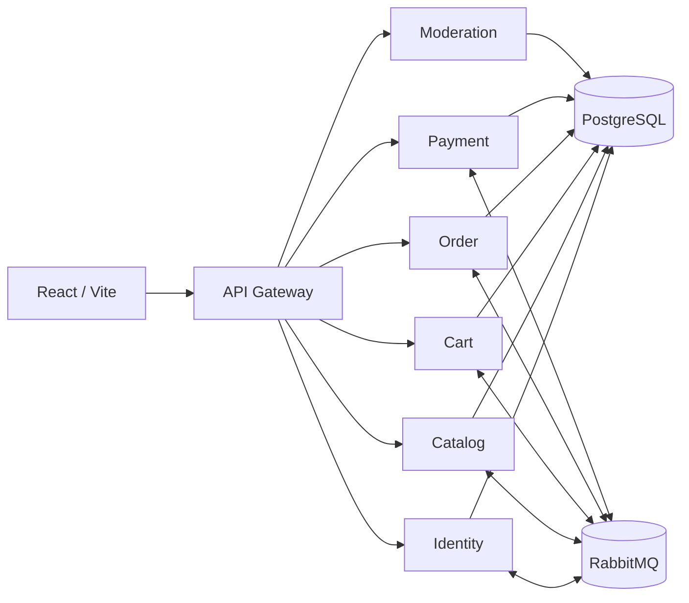

# EcoBazar

EcoBazar es una plataforma web de moda circular para comprar y vender prendas con recolección presencial. Los compradores pueden explorar productos, administrar su carrito, pagar de forma segura mediante Stripe Checkout y consultar sus pedidos; los vendedores pueden consultar las ventas que les corresponden.

El proyecto usa una arquitectura de microservicios con React, Node.js, PostgreSQL, RabbitMQ y Docker Compose. El navegador se comunica únicamente con un API Gateway y cada dominio mantiene sus propios datos.



La explicación completa de servicios, schemas, APIs, Saga, Stripe, Outbox/Inbox, eventos, base de datos y operación está en [DOCUMENTACION_TECNICA.md](DOCUMENTACION_TECNICA.md).

## Requisitos

Para ejecutar toda la aplicación sólo necesitas:

- Git.
- Docker Desktop con Docker Compose.
- Al menos 8 GB de RAM disponibles en el equipo.
- Una cuenta Stripe sandbox y Stripe CLI únicamente si probarás pagos.

No necesitas instalar PostgreSQL, RabbitMQ ni Node.js para levantar el proyecto con Docker.

## Si Ya Tenías Una Versión Antigua

Para este cambio de arquitectura es preferible hacer un clon nuevo en lugar de actualizar una carpeta antigua:

1. Guarda fuera del repositorio cualquier archivo o cambio propio que necesites conservar.
2. Renombra la carpeta antigua como respaldo.
3. Clona nuevamente el repositorio siguiendo la sección de tu sistema operativo.
4. Crea un `.env` nuevo desde `.env.example`.
5. No copies `node_modules`, `.env`, `.secrets` ni datos locales de PostgreSQL de la versión anterior.

Cuando la instalación nueva funcione, puedes eliminar la carpeta de respaldo.

Si alguien ya alcanzó a levantar la versión de microservicios y también quiere borrar sus datos de prueba, debe ejecutar `docker compose down -v` desde esa instalación antes de eliminarla. Este comando es destructivo; no debe usarse si necesita conservar esa base local.

## Opción A: Windows 10/11 Con PowerShell

### 1. Preparar Docker Desktop

1. Instala [Git para Windows](https://git-scm.com/download/win).
2. Instala [Docker Desktop para Windows](https://docs.docker.com/desktop/setup/install/windows-install/).
3. Docker recomienda usar el backend WSL 2. Abre PowerShell como administrador y ejecuta:

```powershell
wsl --install
wsl --update
```

4. Reinicia Windows si te lo solicita.
5. Abre Docker Desktop y espera hasta que indique que el motor está activo.
6. Asegúrate de usar contenedores Linux.
7. Abre una nueva ventana normal de PowerShell y verifica:

```powershell
git --version
docker --version
docker compose version
```

### 2. Clonar El Proyecto

Elige una carpeta de trabajo y ejecuta:

```powershell
git clone https://github.com/AnaGabrielaGarciaHernandez/proyecto_integrador2.git
Set-Location proyecto_integrador2
```

Todos los comandos siguientes deben ejecutarse dentro de `proyecto_integrador2`. Puedes comprobarlo con:

```powershell
Get-Location
Test-Path compose.yaml
```

El segundo comando debe devolver `True`.

### 3. Crear La Configuración Local

```powershell
Copy-Item .env.example .env
notepad .env
```

Para explorar la aplicación sin pagos puedes dejar vacías las variables de Stripe. No cambies los nombres de las variables y nunca subas `.env` a Git.

Guarda y cierra Notepad.

### 4. Construir E Iniciar Todo

```powershell
docker compose up --build -d
```

La primera ejecución tarda más porque descarga y construye las imágenes. Compose también crea PostgreSQL, RabbitMQ, aplica las migraciones de schema y genera las claves JWT RS256.

Revisa el estado:

```powershell
docker compose ps
```

Espera hasta que los servicios persistentes aparezcan como `Up` o `healthy`. Después verifica el API:

```powershell
Invoke-RestMethod http://localhost:4000/api/health | ConvertTo-Json -Depth 5
```

### 5. Abrir La Aplicación

```powershell
Start-Process http://localhost:5173
```

Direcciones útiles:

- Aplicación: http://localhost:5173
- API Gateway: http://localhost:4000/api
- Estado completo: http://localhost:4000/api/health
- RabbitMQ Management: http://localhost:15672

## Opción B: macOS Con Terminal

### 1. Preparar Docker Desktop

1. Instala [Docker Desktop para Mac](https://docs.docker.com/desktop/setup/install/mac-install/).
2. Abre Docker Desktop y espera hasta que el motor esté activo.
3. Abre Terminal y verifica Git y Docker:

```bash
git --version
docker --version
docker compose version
```

Si macOS solicita instalar las Command Line Tools al ejecutar `git`, acepta la instalación y vuelve a abrir Terminal.

### 2. Clonar El Proyecto

```bash
git clone https://github.com/AnaGabrielaGarciaHernandez/proyecto_integrador2.git
cd proyecto_integrador2
```

Comprueba que estás en la raíz:

```bash
pwd
test -f compose.yaml && echo "Raíz correcta"
```

### 3. Crear La Configuración Local

```bash
cp .env.example .env
open -e .env
```

Para explorar la aplicación sin pagos puedes dejar vacías las variables de Stripe. Nunca subas `.env` a Git.

### 4. Construir E Iniciar Todo

```bash
docker compose up --build -d
docker compose ps
```

Espera hasta que los servicios aparezcan como `Up` o `healthy`. Verifica el API:

```bash
curl http://localhost:4000/api/health
```

### 5. Abrir La Aplicación

```bash
open http://localhost:5173
```

Direcciones útiles:

- Aplicación: http://localhost:5173
- API Gateway: http://localhost:4000/api
- Estado completo: http://localhost:4000/api/health
- RabbitMQ Management: http://localhost:15672

## Cargar Datos De Demostración

Una instalación nueva crea la estructura y las categorías, pero empieza sin usuarios ni productos. Para cargar un vendedor y tres prendas de demostración, ejecuta desde la raíz en PowerShell o Terminal:

```text
docker compose exec -T postgres sh -c 'psql -U "$POSTGRES_USER" -d "$POSTGRES_DB" -f /opt/ecobazar/seeds/development.sql'
```

Después recarga http://localhost:5173. El seed es idempotente y exclusivo para desarrollo local.

Cuenta de vendedor demo:

- Correo: `dev-vendedor@ecobazar.com`
- Contraseña: `EcoBazar123!`

Para comprar puedes registrar un usuario nuevo desde la aplicación.

### Crear un Usuario Administrador

El sistema ya cuenta con el panel de administración funcional, pero no existe una ruta pública para registrarse como administrador por motivos de seguridad. Para probar el panel, debes crear una cuenta normal desde la aplicación y luego ejecutar este comando en tu terminal para elevar sus permisos:

En Windows (PowerShell) o macOS (Terminal):
```text
docker compose exec -T postgres sh -c "psql -U \$POSTGRES_USER -d \$POSTGRES_DB -c \"UPDATE identity.users SET role = 'admin' WHERE email = 'tu_correo@example.com';\""
```
*(Recuerda sustituir `tu_correo@example.com` por el correo del usuario que creaste).*

Después de ejecutarlo, si tienes la sesión abierta en el navegador, **cierra sesión y vuelve a entrar** para que se genere un nuevo token con tus privilegios actualizados.

## Configurar Stripe Sandbox En Windows O macOS

Esta sección sólo es necesaria para probar `Ir a pagar`.

### 1. Preparar Las Credenciales

1. Activa un sandbox o modo de prueba en Stripe.
2. Instala [Stripe CLI](https://docs.stripe.com/stripe-cli/install).
3. Abre PowerShell o Terminal y autentica la CLI:

```text
stripe login
```

4. Edita `.env` y coloca una clave sandbox en:

```env
STRIPE_SECRET_KEY=tu_clave_de_prueba
```

Usa preferentemente una restricted API key de prueba con los permisos mínimos necesarios. Nunca uses ni compartas una clave live para desarrollo.

### 2. Iniciar El Listener De Webhooks

En otra ventana de PowerShell o Terminal, ubicada en la raíz del repositorio, ejecuta el comando en una sola línea:

```text
stripe listen --events checkout.session.completed,checkout.session.expired,checkout.session.async_payment_failed --forward-to http://localhost:4000/api/stripe/webhook
```

La CLI mostrará un secreto que comienza con `whsec_`. Cópialo a `.env`:

```env
STRIPE_WEBHOOK_SECRET=tu_secreto_whsec
```

Recrea Payment para que lea las variables nuevas:

```text
docker compose up -d --force-recreate payment-service
```

Mantén abierta la ventana de `stripe listen` mientras realizas pagos. Si detienes el listener y luego lo inicias de nuevo, compara el `whsec_` mostrado con el de `.env`; si cambió, actualízalo y vuelve a recrear `payment-service`.

### 3. Hacer Un Pago De Prueba

Usa únicamente datos de prueba:

- Tarjeta: `4242 4242 4242 4242`.
- Expiración: cualquier fecha futura.
- CVC: cualquier valor válido de tres dígitos.
- Código postal: cualquier valor de prueba válido.

El navegador no marca una orden como pagada. La confirmación aparece cuando Stripe CLI entrega el webhook firmado a Payment.

## Uso Diario

Ejecuta estos comandos desde la raíz del repositorio tanto en PowerShell como en Terminal.

Iniciar contenedores existentes:

```text
docker compose up -d
```

Reconstruir después de cambios en código o dependencias:

```text
docker compose up --build -d
```

Ver estado:

```text
docker compose ps
```

Seguir todos los logs:

```text
docker compose logs -f
```

Seguir únicamente checkout:

```text
docker compose logs -f order-service payment-service catalog-service
```

Presiona `Ctrl+C` para dejar de seguir los logs. Los contenedores continúan ejecutándose.

Detener conservando datos:

```text
docker compose down
```

Reiniciar un servicio:

```text
docker compose restart payment-service
```

## Limpiar Completamente El Entorno

```text
docker compose down -v
```

Advertencia: `-v` elimina la base de datos, las colas y las claves JWT locales. Úsalo únicamente cuando quieras comenzar desde cero.

Las carpetas `node_modules`, `dist`, `.secrets`, `dogfood-output` y los archivos `.env` también son locales y no deben subirse al repositorio.

## Ejecutar Las Pruebas

Para trabajar fuera de los contenedores instala Node.js 24 y npm 11.

En macOS puedes ejecutar la suite desde Terminal. En Windows usa WSL 2 o Git Bash para la suite completa: varios workspaces usan la herramienta POSIX `find`, que no existe en PowerShell/CMD nativo.

Desde la raíz del repositorio, en macOS, WSL o Git Bash:

```text
npm install
npm test
npm run check
npm run lint
npm run build
```

La última verificación aprobó 74 de 74 pruebas, los checks de todos los workspaces, ESLint y el build del frontend.

## Problemas Comunes

### `no configuration file provided: not found`

La terminal no está en la raíz del repositorio. Regresa a `proyecto_integrador2` y comprueba que exista `compose.yaml`.

Windows:

```powershell
Set-Location ruta\al\proyecto_integrador2
Test-Path compose.yaml
```

macOS:

```bash
cd /ruta/al/proyecto_integrador2
ls compose.yaml
```

### Payment responde `STRIPE_UNAVAILABLE`

Revisa que `.env` contenga la clave sandbox y el secreto del listener. Después ejecuta:

```text
docker compose up -d --force-recreate payment-service
docker compose logs --tail=100 payment-service
```

### Un puerto ya está ocupado

Detén la aplicación que usa el puerto o ajusta los puertos locales en `.env`/`compose.yaml`. Los principales son `5173`, `4000`, `55432`, `5672` y `15672`.

### Un servicio no aparece saludable

```text
docker compose ps
docker compose logs --tail=150 nombre-del-servicio
```

Empieza revisando PostgreSQL, RabbitMQ y el job de migraciones de schema `migrate`.

## Alcance Actual

- Recolección presencial gratuita.
- Una sola cuenta Stripe cobra el pedido completo.
- El panel de Admin ya está integrado para administrar usuarios, reportes y solicitudes de nuevos vendedores.
- Reviews permanece reservado para otra iteración.
- Stripe Connect, payouts, refunds, devoluciones y programación de pickup están fuera de alcance.

Consulta [DOCUMENTACION_TECNICA.md](DOCUMENTACION_TECNICA.md) antes de modificar la arquitectura, los contratos de eventos o la Saga de checkout.
