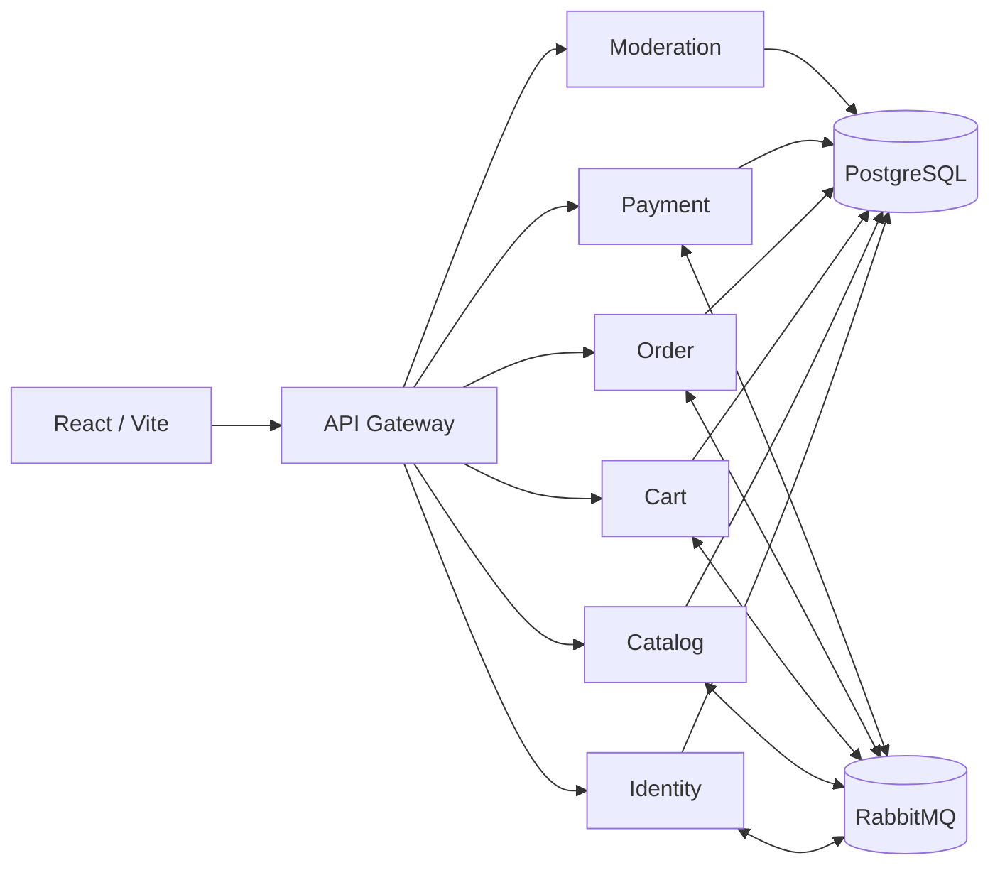

# EcoBazar

EcoBazar es una plataforma web de moda circular para comprar y vender prendas con recolección presencial. Los compradores pueden explorar productos, administrar su carrito, pagar de forma segura mediante Stripe Checkout y consultar sus pedidos; los vendedores pueden consultar las ventas que les corresponden.

El proyecto usa una arquitectura de microservicios con React, Node.js, PostgreSQL, RabbitMQ y Docker Compose. El navegador se comunica únicamente con un API Gateway y cada dominio mantiene sus propios datos.


```mermaid
flowchart LR
  WEB[React / Vite] --> GW[API Gateway]
  GW --> ID[Identity]
  GW --> CAT[Catalog]
  GW --> CART[Cart]
  GW --> ORD[Order]
  GW --> PAY[Payment]
  GW --> MOD[Moderation]
  ID --> PG[(PostgreSQL)]
  CAT --> PG
  CART --> PG
  ORD --> PG
  PAY --> PG
  MOD --> PG
  ID <--> MQ[(RabbitMQ)]
  CAT <--> MQ
  CART <--> MQ
  ORD <--> MQ
  PAY <--> MQ
```

La explicación completa de servicios, schemas, APIs, Saga, Stripe, Outbox/Inbox, eventos, base de datos y operación está en [DOCUMENTACION_TECNICA.md](DOCUMENTACION_TECNICA.md).

La documentación de privacidad, retención y controles de datos está en [aviso simplificado](docs/AVISO_PRIVACIDAD_SIMPLIFICADO.md), [aviso integral](docs/AVISO_PRIVACIDAD_INTEGRAL.md) y [política de retención](docs/POLITICA_RETENCION_Y_CONTROLES.md). La guía de despliegue y operación VPS está en [OPERACION_PRODUCCION.md](docs/OPERACION_PRODUCCION.md); los datos legales reales se inyectan mediante `.env.production` y deben validarse con asesoría legal.

## Guía rápida de producción en Google Cloud

La aplicación de producción corre en la VM `ecobazar-production`, zona `us-central1-a`, y se publica en `https://app.eco-bazar.store`. La guía completa de respaldos, restauración, despliegues automatizados y operación está en [docs/OPERACION_PRODUCCION.md](docs/OPERACION_PRODUCCION.md).

### Entrar a la VM

Desde Cloud Shell o desde un equipo que tenga instalada la CLI de Google Cloud, ejecuta el comando completo en una sola línea:

```bash
gcloud compute ssh ecobazar-production --project=eco-bazar-502223 --zone=us-central1-a
```

Si el proyecto no está configurado en Cloud Shell, puedes dejarlo establecido una vez:

```bash
gcloud config set project eco-bazar-502223
```

Después de entrar a la VM, ve a la carpeta de producción:

```bash
cd /opt/ecobazar/proyecto_integrador2
```

No guardes `.env.production`, `.secrets` ni claves de terceros en GitHub. Esos archivos deben permanecer únicamente en la VM.

### Levantar la página

Para iniciar los contenedores existentes sin reconstruir imágenes:

```bash
docker compose --env-file .env.production -f compose.yaml -f compose.production.yaml up -d
```

Para desplegar cambios nuevos desde `main`, usa:

```bash
git pull --ff-only origin main
docker compose --env-file .env.production -f compose.yaml -f compose.production.yaml config --quiet
docker compose --env-file .env.production -f compose.yaml -f compose.production.yaml up -d --build --remove-orphans
```

Comprueba el estado y la aplicación:

```bash
docker compose --env-file .env.production -f compose.yaml -f compose.production.yaml ps
APP_URL="https://app.eco-bazar.store" ./scripts/smoke-production.sh
```

El resultado esperado del smoke test es `production smoke checks passed`. Caddy se encarga del HTTPS y de publicar el frontend y el API Gateway.

### Si la página se cae

Primero revisa si la VM está encendida desde Cloud Shell:

```bash
gcloud compute instances describe ecobazar-production --project=eco-bazar-502223 --zone=us-central1-a --format='get(status)'
```

Si devuelve `TERMINATED`, enciéndela:

```bash
gcloud compute instances start ecobazar-production --project=eco-bazar-502223 --zone=us-central1-a
```

Entra de nuevo por SSH y revisa contenedores, salud y logs:

```bash
cd /opt/ecobazar/proyecto_integrador2
docker compose --env-file .env.production -f compose.yaml -f compose.production.yaml ps
docker compose --env-file .env.production -f compose.yaml -f compose.production.yaml logs --tail=100 caddy frontend-web api-gateway
curl --fail --silent --show-error https://app.eco-bazar.store/health/live
```

Si los contenedores están detenidos, arráncalos:

```bash
docker compose --env-file .env.production -f compose.yaml -f compose.production.yaml up -d
```

Si sólo falló el frontend o el proxy, puedes reiniciar esos servicios sin reconstruir imágenes:

```bash
docker compose --env-file .env.production -f compose.yaml -f compose.production.yaml restart frontend-web caddy
```

### Diagnósticos frecuentes

Si falla `migrate`, revisa el error antes de volver a arrancar los servicios:

```bash
docker compose --env-file .env.production -f compose.yaml -f compose.production.yaml logs --tail=200 migrate
```

Después de corregir el problema de configuración o credenciales, ejecuta la migración manualmente y vuelve a levantar la aplicación:

```bash
docker compose --env-file .env.production -f compose.yaml -f compose.production.yaml run --rm --no-deps migrate
docker compose --env-file .env.production -f compose.yaml -f compose.production.yaml up -d
```

Si falla `jwt-keys`, no generes un par nuevo en producción: el cambio invalidaría los tokens existentes. Revisa los logs y confirma que los archivos estén presentes en `.secrets`; si faltan, restáuralos desde un respaldo seguro.

```bash
docker compose --env-file .env.production -f compose.yaml -f compose.production.yaml logs --tail=100 jwt-keys
ls -l .secrets
```

### Rollback a una versión conocida

Si un despliegue nuevo rompe la aplicación, identifica el commit estable y vuelve a desplegarlo. Sustituye `<commit-estable>` por el hash que hayas verificado:

```bash
git fetch origin
git checkout <commit-estable>
docker compose --env-file .env.production -f compose.yaml -f compose.production.yaml up -d --build --remove-orphans
APP_URL="https://app.eco-bazar.store" ./scripts/smoke-production.sh
```

No ejecutes `docker compose down -v` en producción: elimina volúmenes y puede borrar la base de datos, colas y datos persistentes.

### Respaldos y restauración

El respaldo debe ejecutarse con las variables de Restic configuradas en `.env.production`:

```bash
ENV_FILE=.env.production ./scripts/backup-production.sh
```

La restauración sobrescribe datos de producción y sólo debe ejecutarse después de confirmar el snapshot correcto:

```bash
RESTORE_CONFIRM=YES ENV_FILE=.env.production ./scripts/restore-production.sh
```

Después de cualquier restauración, ejecuta el smoke test y revisa los logs. La restauración de archivos de Supabase puede requerir una acción adicional según el proveedor.

### Trabajo normal de desarrollo

En tu computadora continúa usando `.env` y únicamente `compose.yaml`:

```bash
docker compose up --build -d
```

En producción usa siempre `.env.production` junto con `compose.yaml` y `compose.production.yaml`. Prueba los cambios localmente, súbelos a GitHub y despliega después; nunca copies el `.env` local sobre `.env.production`.

## Requisitos

Para ejecutar toda la aplicación sólo necesitas:

- Git.
- Docker Desktop con Docker Compose.
- Al menos 8 GB de RAM disponibles en el equipo.
- Una cuenta Stripe sandbox y Stripe CLI únicamente si probarás pagos.

No necesitas instalar PostgreSQL, RabbitMQ ni Node.js para levantar el proyecto con Docker.

## Opción A: Windows 10/11 Con PowerShell

### 1. Preparar Docker Desktop

1. Instala [Git para Windows](https://git-scm.com/download/win).
2. Instala [Docker Desktop para Windows](https://docs.docker.com/desktop/setup/install/windows-install/).
3. Docker recomienda usar el backend WSL 2. Abre PowerShell como administrador y ejecuta:

```powershell
wsl --install
wsl --update
```

4. Reinicia Windows si te lo solicita.
5. Abre Docker Desktop y espera hasta que indique que el motor está activo.
6. Asegúrate de usar contenedores Linux.
7. Abre una nueva ventana normal de PowerShell y verifica:

```powershell
git --version
docker --version
docker compose version
```

### 2. Clonar El Proyecto

Elige una carpeta de trabajo y ejecuta:

```powershell
git clone https://github.com/AnaGabrielaGarciaHernandez/proyecto_integrador2.git
Set-Location proyecto_integrador2
```

Todos los comandos siguientes deben ejecutarse dentro de `proyecto_integrador2`. Puedes comprobarlo con:

```powershell
Get-Location
Test-Path compose.yaml
```

El segundo comando debe devolver `True`.

### 3. Crear La Configuración Local

```powershell
Copy-Item .env.example .env
notepad .env
```

Para explorar la aplicación sin pagos puedes dejar vacías las variables de Stripe. No cambies los nombres de las variables y nunca subas `.env` a Git.

Guarda y cierra Notepad.

### 4. Construir E Iniciar Todo

```powershell
docker compose up --build -d
```

La primera ejecución tarda más porque descarga y construye las imágenes. Compose también crea PostgreSQL, RabbitMQ, aplica las migraciones de schema y genera las claves JWT RS256.

Revisa el estado:

```powershell
docker compose ps
```

Espera hasta que los servicios persistentes aparezcan como `Up` o `healthy`. Después verifica el API:

```powershell
Invoke-RestMethod http://localhost:4000/api/health | ConvertTo-Json -Depth 5
```

### 5. Abrir La Aplicación

```powershell
Start-Process http://localhost:5173
```

Direcciones útiles:

- Aplicación: http://localhost:5173
- API Gateway: http://localhost:4000/api
- Estado completo: http://localhost:4000/api/health
- RabbitMQ Management: http://localhost:15672

## Opción B: macOS Con Terminal

### 1. Preparar Docker Desktop

1. Instala [Docker Desktop para Mac](https://docs.docker.com/desktop/setup/install/mac-install/).
2. Abre Docker Desktop y espera hasta que el motor esté activo.
3. Abre Terminal y verifica Git y Docker:

```bash
git --version
docker --version
docker compose version
```

Si macOS solicita instalar las Command Line Tools al ejecutar `git`, acepta la instalación y vuelve a abrir Terminal.

### 2. Clonar El Proyecto

```bash
git clone https://github.com/AnaGabrielaGarciaHernandez/proyecto_integrador2.git
cd proyecto_integrador2
```

Comprueba que estás en la raíz:

```bash
pwd
test -f compose.yaml && echo "Raíz correcta"
```

### 3. Crear La Configuración Local

```bash
cp .env.example .env
open -e .env
```

Para explorar la aplicación sin pagos puedes dejar vacías las variables de Stripe. Nunca subas `.env` a Git.

### 4. Construir E Iniciar Todo

```bash
docker compose up --build -d
docker compose ps
```

Espera hasta que los servicios aparezcan como `Up` o `healthy`. Verifica el API:

```bash
curl http://localhost:4000/api/health
```

### 5. Abrir La Aplicación

```bash
open http://localhost:5173
```

Direcciones útiles:

- Aplicación: http://localhost:5173
- API Gateway: http://localhost:4000/api
- Estado completo: http://localhost:4000/api/health
- RabbitMQ Management: http://localhost:15672

## Cargar Datos De Demostración

Una instalación nueva crea la estructura y las categorías, pero empieza sin usuarios ni productos. Para cargar un vendedor y tres prendas de demostración, ejecuta desde la raíz en PowerShell o Terminal:

```text
docker compose exec -T postgres sh -c 'psql -U "$POSTGRES_USER" -d "$POSTGRES_DB" -f /opt/ecobazar/seeds/development.sql'
```

Después recarga http://localhost:5173. El seed es idempotente y exclusivo para desarrollo local.

Cuenta de vendedor demo:

- Correo: `dev-vendedor@ecobazar.com`
- Contraseña: `EcoBazar123!`

Para comprar puedes registrar un usuario nuevo desde la aplicación.

### Crear un Usuario Administrador

El sistema ya cuenta con el panel de administración funcional, pero no existe una ruta pública para registrarse como administrador por motivos de seguridad. Para probar el panel, debes crear una cuenta normal desde la aplicación y luego ejecutar este comando en tu terminal para elevar sus permisos:

En Windows (PowerShell) o macOS (Terminal):
```text
docker compose exec -T postgres sh -c "psql -U \$POSTGRES_USER -d \$POSTGRES_DB -c \"UPDATE identity.users SET role = 'admin' WHERE email = 'tu_correo@example.com';\""
```
*(Recuerda sustituir `tu_correo@example.com` por el correo del usuario que creaste).*

Después de ejecutarlo, si tienes la sesión abierta en el navegador, **cierra sesión y vuelve a entrar** para que se genere un nuevo token con tus privilegios actualizados.

## Configurar Supabase Storage Para Avatares

La edición de perfil acepta JSON para el nombre y `multipart/form-data` para una foto. El navegador nunca recibe ni usa la clave privada de Supabase.

1. En Supabase crea un bucket público llamado `avatars`.
2. Configura un límite de 5 MB y permite únicamente `image/jpeg`, `image/png` e `image/webp`.
3. Mantén deshabilitadas las subidas desde el navegador; el bucket sólo necesita lectura pública para mostrar las fotos.
4. Coloca estas variables en `.env` para que Compose las entregue exclusivamente a `identity-service`:

```env
SUPABASE_URL=https://tu-proyecto.supabase.co
SUPABASE_SERVER_KEY=tu_clave_privada_de_servidor
SUPABASE_AVATAR_BUCKET=avatars
```

La clave debe ser una clave privada de servidor y no debe comenzar con `VITE_`, entrar en `frontend-web` ni aparecer en respuestas HTTP. Las fotos se procesan en el backend, se guardan como WebP de 256×256 y se conserva sólo su URL pública en `identity.users.avatar_url`. No se migran los `data:` URLs existentes; usa una base limpia o elimínalos manualmente en desarrollo.

Después de cambiar código o dependencias usa `docker compose up --build -d`; `docker compose restart` sólo reinicia la imagen que ya estaba construida. Después de cambiar únicamente `.env`, recrea al menos `identity-service` con `docker compose up -d --force-recreate identity-service`.

Consulta la [documentación de buckets de Supabase](https://supabase.com/docs/guides/storage/buckets/fundamentals) y la de [control de acceso de Storage](https://supabase.com/docs/guides/storage/security/access-control) al endurecer el proyecto para producción.

En `Cuenta` también están disponibles `Descargar mis datos` y `Solicitar eliminación`. La descarga consulta `GET /api/auth/privacy/export`; la eliminación usa `POST /api/auth/privacy/deletion-request`, revoca la sesión de inmediato y termina de forma asíncrona mediante los servicios internos. Ambas acciones tienen rate limiting persistido en PostgreSQL.

## Configurar Stripe Sandbox En Windows O macOS

Esta sección sólo es necesaria para probar `Ir a pagar`.

### 1. Preparar Las Credenciales

1. Activa un sandbox o modo de prueba en Stripe.
2. Instala [Stripe CLI](https://docs.stripe.com/stripe-cli/install).
3. Abre PowerShell o Terminal y autentica la CLI:

```text
stripe login
```

4. Edita `.env` y coloca una clave sandbox en:

```env
STRIPE_SECRET_KEY=tu_clave_de_prueba
```

Usa preferentemente una restricted API key de prueba con los permisos mínimos necesarios. Nunca uses ni compartas una clave live para desarrollo.

### 2. Iniciar El Listener De Webhooks

En otra ventana de PowerShell o Terminal, ubicada en la raíz del repositorio, ejecuta el comando en una sola línea:

```text
stripe listen --events checkout.session.completed,checkout.session.expired,checkout.session.async_payment_failed --forward-to http://localhost:4000/api/stripe/webhook
```

La CLI mostrará un secreto que comienza con `whsec_`. Cópialo a `.env`:

```env
STRIPE_WEBHOOK_SECRET=tu_secreto_whsec
```

Recrea Payment para que lea las variables nuevas:

```text
docker compose up -d --force-recreate payment-service
```

Mantén abierta la ventana de `stripe listen` mientras realizas pagos. Si detienes el listener y luego lo inicias de nuevo, compara el `whsec_` mostrado con el de `.env`; si cambió, actualízalo y vuelve a recrear `payment-service`.

### 3. Hacer Un Pago De Prueba

Usa únicamente datos de prueba:

- Tarjeta: `4242 4242 4242 4242`.
- Expiración: cualquier fecha futura.
- CVC: cualquier valor válido de tres dígitos.
- Código postal: cualquier valor de prueba válido.

El navegador no marca una orden como pagada. La confirmación aparece cuando Stripe CLI entrega el webhook firmado a Payment.

## Uso Diario

Ejecuta estos comandos desde la raíz del repositorio tanto en PowerShell como en Terminal.

Iniciar contenedores existentes:

```text
docker compose up -d
```

Reconstruir después de cambios en código o dependencias:

```text
docker compose up --build -d
```

Ver estado:

```text
docker compose ps
```

Seguir todos los logs:

```text
docker compose logs -f
```

Seguir únicamente checkout:

```text
docker compose logs -f order-service payment-service catalog-service
```

Presiona `Ctrl+C` para dejar de seguir los logs. Los contenedores continúan ejecutándose.

Detener conservando datos:

```text
docker compose down
```

Reiniciar un servicio:

```text
docker compose restart payment-service
```

## Limpiar Completamente El Entorno

```text
docker compose down -v
```

Advertencia: `-v` elimina la base de datos, las colas y las claves JWT locales. Úsalo únicamente cuando quieras comenzar desde cero.

Las carpetas `node_modules`, `dist`, `.secrets`, `dogfood-output` y los archivos `.env` también son locales y no deben subirse al repositorio.

## Ejecutar Las Pruebas

Para trabajar fuera de los contenedores instala Node.js 24 y npm 11.

En macOS puedes ejecutar la suite desde Terminal. En Windows usa WSL 2 o Git Bash para la suite completa: varios workspaces usan la herramienta POSIX `find`, que no existe en PowerShell/CMD nativo.

Desde la raíz del repositorio, en macOS, WSL o Git Bash:

```text
npm install
npm test
npm run check
npm run lint
npm run build
```

La última verificación aprobó 74 de 74 pruebas, los checks de todos los workspaces, ESLint y el build del frontend.

## Alcance Actual

- Recolección presencial gratuita.
- Una sola cuenta Stripe cobra el pedido completo.
- El panel de Admin ya está integrado para administrar usuarios, reportes y solicitudes de nuevos vendedores.
- Reviews permanece reservado para otra iteración.
- Stripe Connect, payouts, refunds, devoluciones y programación de pickup están fuera de alcance.

Consulta [DOCUMENTACION_TECNICA.md](DOCUMENTACION_TECNICA.md) antes de modificar la arquitectura, los contratos de eventos o la Saga de checkout.
